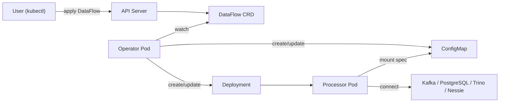
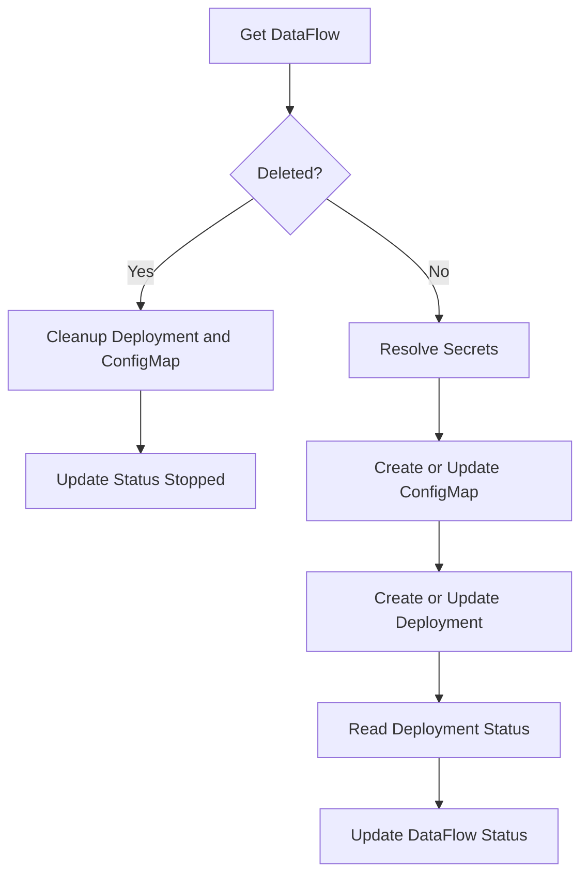
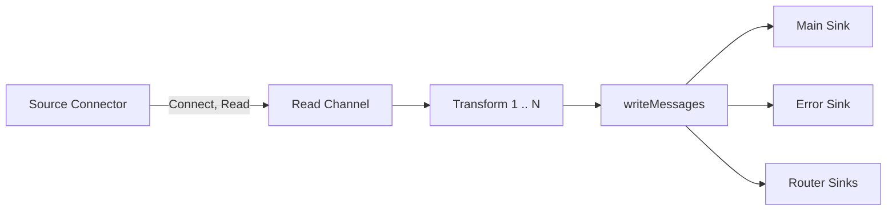

# Architecture

This section describes how the DataFlow Operator works: its role in Kubernetes, the reconciliation loop, and the runtime data flow inside each processor.

## Overview

The DataFlow Operator provides **declarative management of data pipelines** via a Kubernetes Custom Resource (CRD). You define a **DataFlow** resource with a source, optional transformations, and a sink; the operator ensures that a **processor** workload runs in the cluster and continuously reads from the source, applies transformations, and writes to the sink (and optionally to an error sink).

High-level flow:

1. You create or update a **DataFlow** (e.g. with `kubectl apply`).
2. The **operator** watches DataFlow resources and, for each one, creates or updates a **ConfigMap** (with the resolved spec) and a **Deployment** (one pod running the processor binary).
3. Each **processor pod** reads the spec from the mounted ConfigMap, connects to the configured source and sink(s), and runs the pipeline: read → transform → write.

## Kubernetes Architecture

### Custom Resource Definition (CRD)

- **API group**: `dataflow.dataflow.io`
- **Resource**: `dataflows` (kind `DataFlow`), **namespaced**.
- **Spec** includes:
  - **Source**: type (e.g. `kafka`, `postgresql`, `trino`) and type-specific config (brokers, topic, connection string, etc.).
  - **Sink**: type and config for the main destination.
  - **Transformations**: ordered list (timestamp, flatten, filter, mask, router, select, remove, snakeCase, camelCase, etc.).
  - **Errors**: optional sink for messages that fail to be written to the main sink.
  - **Resources**: optional CPU/memory for the processor pod.
  - **Scheduling**: optional `nodeSelector`, `affinity`, `tolerations`.

Secrets can be referenced via `SecretRef` in the spec; the operator resolves them before writing the spec into the ConfigMap.

### Operator Deployment

The operator runs as a single **Deployment** in the cluster (e.g. installed via Helm). It uses **controller-runtime** and a single controller, **DataFlowReconciler**, which reconciles `DataFlow` resources. **Leader election** (ID `dataflow-operator.dataflow.io`) is enabled so that with multiple replicas only one active leader runs the reconciliation loop (high availability).

### Controller

The **DataFlowReconciler**:

- **Watches**: `DataFlow` (primary), and **owns** `Deployment` and `ConfigMap` for each DataFlow (so their lifecycle is tied to the DataFlow).
- Optionally watches the **operator’s own Deployment** (when `OPERATOR_DEPLOYMENT_NAME` and `OPERATOR_NAMESPACE` are set). When that Deployment is updated (e.g. new image), the controller triggers reconciliation for **all** DataFlow resources so that processor Deployments can be updated to use the new processor image.

### Resources Created per DataFlow

For each DataFlow `<name>` in a namespace:

| Resource | Name | Purpose |
|----------|------|---------|
| ConfigMap | `dataflow-<name>-spec` | Holds `spec.json` (resolved spec with secrets inlined). |
| Deployment | `dataflow-<name>` | One replica; pod runs the **processor** container. |

The processor container:

- Image: from env `PROCESSOR_IMAGE` (often same as operator image/tag).
- Args: `--spec-path=/etc/dataflow/spec.json`, `--namespace=...`, `--name=...`.
- Volume: ConfigMap `dataflow-<name>-spec` mounted at `/etc/dataflow` (read-only).
- Env: `LOG_LEVEL` (e.g. from `PROCESSOR_LOG_LEVEL`).

The controller sets **owner references** from the DataFlow to the ConfigMap and Deployment so they are deleted when the DataFlow is deleted.

### RBAC

The operator uses a **ClusterRole** (and **ClusterRoleBinding** to its ServiceAccount) with permissions to:

- Read/write **DataFlow** and status (CRD).
- Create/patch **events**.
- Read **secrets** (for resolution).
- Create/update/delete **ConfigMaps** and **Deployments** in the same namespaces as DataFlow resources.

See the Helm templates (e.g. `clusterrole.yaml`, `clusterrolebinding.yaml`) and the manifest under `config/rbac/` for the exact rules.

### Optional: GUI

The Helm chart can deploy an optional **GUI** (separate Deployment, Service, and optionally Ingress) for viewing and managing data flows. It is independent of the core operator and processor architecture.

### Admission Webhook (Validating)

The operator can serve a **Validating Admission Webhook**: when a DataFlow resource is created or updated, the Kubernetes API server sends the object to the operator on port 9443; the operator validates the spec (source/sink types, required fields, allowed transformations, etc.) and either allows the operation or rejects it with a clear error message.

**Why it matters:** without the webhook, an invalid spec (wrong source/sink type, missing required fields, unknown transformation) only fails **at runtime** — after the controller has created the ConfigMap and Deployment and the processor fails to build a connector or transformer on startup. Users see the error in the DataFlow status or pod logs, not at `kubectl apply`. With the webhook enabled, invalid specs are rejected **before being stored in etcd**: `kubectl apply` and the GUI get a 4xx response with the error text, no extra resources are created, and no processor pod is started with a broken configuration.

**Optional:** the webhook is controlled only at the Helm level (value `webhook.enabled`). By default it is disabled: no ValidatingWebhookConfiguration is created, and the API server does not call the operator on DataFlow create/update. See [Configuring the Validating Webhook](development.md#configuring-the-validating-webhook) in the development guide for TLS, caBundle, and production setup.

---

## Architecture Diagram (Kubernetes)

The following diagram shows how the user, API server, operator, and processor pods interact.

---

## Reconciliation Loop

For each DataFlow, the controller runs the following steps (on create, update, or when owned resources change):

1. **Get DataFlow**  
   If not found, return. If **DeletionTimestamp** is set: delete the Deployment and ConfigMap (cleanup), update status to `Stopped`, then return.

2. **Resolve secrets**  
   Use **SecretResolver** to substitute all `SecretRef` fields in the spec with values from Kubernetes Secrets. Result: **resolved spec**.

3. **ConfigMap**  
   Create or update the ConfigMap `dataflow-<name>-spec` with key `spec.json` = JSON of the resolved spec. Set controller reference to the DataFlow.

4. **Deployment**  
   Create or update the Deployment `dataflow-<name>`: processor image, volume from that ConfigMap, args and env as above. Use resources/affinity from DataFlow spec if set. Set controller reference to the DataFlow.

5. **Deployment status**  
   Read the Deployment; set DataFlow status **Phase** and **Message** from it (e.g. `Running` when `ReadyReplicas > 0`, `Pending` when replicas are starting, `Error` when no replicas).

6. **Update DataFlow status**  
   Write Phase, Message, and other status fields back to the DataFlow resource (with retry on conflict).

### Reconcile Loop Diagram

---

## Data Processor (Runtime)

The **processor** is the component that actually moves data: it reads from the source, applies transformations, and writes to the sink(s). It runs inside the pod created by the operator.

### Entrypoint

The processor binary (built from `cmd/processor/main.go`) is started with:

- `--spec-path` (default `/etc/dataflow/spec.json`)
- `--namespace`, `--name` (DataFlow namespace and name for logging and metrics)

It reads the spec from the file, builds a **Processor** from it, and runs `Processor.Start(ctx)` until the context is cancelled (e.g. SIGTERM).

### Processor Structure

The **Processor** (in `internal/processor/processor.go`) is built from the spec and contains:

- **Source**: a **SourceConnector** (Kafka, PostgreSQL, Trino, or Nessie) — `Connect`, `Read`, `Close`.
- **Sink**: a **SinkConnector** for the main destination — `Connect`, `Write`, `Close`.
- **Error sink** (optional): another SinkConnector for failed writes.
- **Transformations**: an ordered list of **Transformer** implementations (timestamp, flatten, filter, mask, router, select, remove, snakeCase, camelCase).
- **Router sinks**: if a `router` transformation is used, a map from condition to **SinkSpec** for dynamic sinks.

Connectors are created by a factory from `spec.Source` and `spec.Sink` (and `spec.Errors`); see `internal/connectors/`.

### Execution Flow

1. **Connect**  
   `source.Connect(ctx)`, then `sink.Connect(ctx)`, then optionally `errorSink.Connect(ctx)`.

2. **Read**  
   `source.Read(ctx)` returns a channel of **Message** (each message has payload and optional metadata, e.g. `routed_condition` from the router).

3. **Process**  
   A goroutine runs **processMessages**: for each message from the channel, it applies **transformations in order**. Each transformer takes one or more messages and returns one or more (e.g. filter drops some, flatten can emit many, router attaches `routed_condition` and can emit to different logical routes). Output messages are sent to an internal channel.

4. **Write**  
   **writeMessages** consumes that channel:
   - If there are **router** sinks: messages are routed by metadata to the matching route sink or the default (main) sink; each route may have its own connector (created and connected on demand).
   - Otherwise: all messages go to the main sink.
   - On write failure, if an **error sink** is configured, the failed message can be sent there.

Connector interfaces are defined in `internal/connectors/interface.go`: **SourceConnector** (Connect, Read, Close), **SinkConnector** (Connect, Write, Close).

### Connectors and Transformations

- **Source/Sink types**: Kafka, PostgreSQL, Trino, Nessie (selected by `spec.source.type` and `spec.sink.type`).
- **Transformations** (order matters): timestamp, flatten, filter, mask, router, select, remove, snakeCase, camelCase. They are applied in the order listed in `spec.transformations`.

### Data Flow in the Processor (Diagram)

---

## Summary

- **Kubernetes**: You declare a **DataFlow** CR; the **operator** reconciles it into a **ConfigMap** (spec) and a **Deployment** (processor pod). RBAC and optional GUI complete the picture.
- **Reconciliation**: Get DataFlow → resolve secrets → update ConfigMap → update Deployment → reflect Deployment status in DataFlow status.
- **Runtime**: Each **processor** pod runs a single pipeline: source → read channel → transformations → write to main (and optionally error and router) sinks, using pluggable connectors and a fixed set of transformations.
