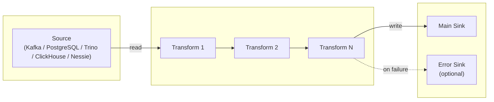
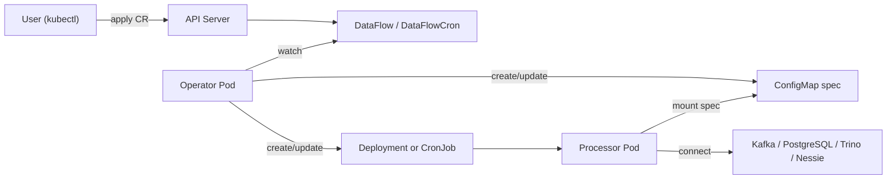
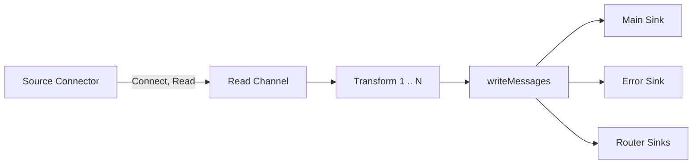

# Architecture

This section describes how the DataFlow Operator works: its role in Kubernetes, the reconciliation model, and the runtime data flow inside each processor.

## Overview

The DataFlow Operator provides **declarative management of data pipelines** via Kubernetes Custom Resources. You define a pipeline with a source, optional transformations, and a sink; the operator ensures a **processor** workload runs in the cluster.

Two CRDs orchestrate pipelines differently:

| CRD | Workload | Doc |
|-----|----------|-----|
| **DataFlow** | Long-lived Deployment | [DataFlow](dataflow/index.md) |
| **DataFlowCron** | CronJob + Jobs per tick | [DataFlowCron](dataflow-cron/index.md) |

See [Workload Types](concepts/workload-types.md) for when to use each.

High-level flow for **DataFlow**:

1. You create or update a **DataFlow** (e.g. with `kubectl apply`).
2. The **operator** creates or updates a **ConfigMap** (resolved spec) and a **Deployment** (processor pod).
3. Each **processor pod** runs the pipeline: read → transform → write.

### Data Flow Pipeline (Conceptual)

The data flow in each processor follows a linear pipeline: **Source** → **Transformations** → **Sink**. Optionally, failed writes go to an **Error Sink**.

```mermaid
flowchart LR
  subgraph Input[" "]
    Source["Source\n(Kafka / PostgreSQL / Trino / ClickHouse / Nessie)"]
  end

  subgraph Transform[" "]
    T1["Transform 1"]
    T2["Transform 2"]
    TN["Transform N"]
    T1 --> T2 --> TN
  end

  subgraph Output[" "]
    MainSink["Main Sink"]
    ErrSink["Error Sink\n(optional)"]
  end

  Source -->|"read"| T1
  TN -->|"write"| MainSink
  TN -.->|"on failure"| ErrSink
```

Transformations are applied in order: `timestamp`, `flatten`, `filter`, `mask`, `router`, `select`, `remove`, `snakeCase`, `camelCase`. Each message passes through the chain before being written to the sink.

## Kubernetes Architecture

### Custom Resources

- **API group**: `dataflow.dataflow.io`
- **`DataFlow`** (`dataflows`) — continuous processor via Deployment. Details: [DataFlow Spec](dataflow/spec.md), [Lifecycle](dataflow/lifecycle.md).
- **`DataFlowCron`** (`dataflowcrons`) — scheduled runs via CronJob, optional [triggers](dataflow-cron/triggers.md). Details: [DataFlowCron Spec](dataflow-cron/spec.md).

Secrets are referenced via `SecretRef` in the spec; the operator resolves them before writing the spec into the ConfigMap.

### Operator Deployment

The operator runs as a **Deployment** in the cluster (e.g. installed via Helm). It uses **controller-runtime** with **DataFlowReconciler** and **DataFlowCronReconciler**. **Leader election** (ID `dataflow-operator.dataflow.io`) ensures only one active leader reconciles when multiple operator replicas run.

### Controllers

**DataFlowReconciler**:

- **Watches**: `DataFlow` (primary), owns `Deployment` and `ConfigMap`.
- Optionally watches the operator Deployment to roll processor images on operator upgrade.

**DataFlowCronReconciler**:

- **Watches**: `DataFlowCron`, manages `CronJob`, spec ConfigMap, processor Jobs, and trigger Jobs.

Reconciliation details: [DataFlow Lifecycle](dataflow/lifecycle.md), [DataFlowCron Spec](dataflow-cron/spec.md).

### RBAC

The operator **ClusterRole** allows read/write on CRDs and status, secret resolution, and create/update/delete of ConfigMaps, Deployments, CronJobs, Jobs, and processor RBAC. See Helm templates for exact rules.

### Optional: GUI

The Helm chart can deploy an optional **GUI** (separate Deployment, Service, Ingress) for viewing and managing data flows.

### Admission Webhook (Validating)

When enabled, the operator validates **DataFlow** and **DataFlowCron** specs at admission (port 9443) — rejecting invalid source/sink types, transformations, schedule, or triggers **before** resources are stored.

**Why it matters:** without the webhook, invalid specs fail at runtime in processor pods. With the webhook, `kubectl apply` gets an immediate error.

**Optional:** controlled by Helm `webhook.enabled` (default disabled). See [Configuring the Validating Webhook](development.md#configuring-the-validating-webhook).

---

## Architecture Diagram (Kubernetes)

```mermaid
flowchart LR
  User["User (kubectl)"]
  API["API Server"]
  CRD["DataFlow / DataFlowCron"]
  Operator["Operator Pod"]
  CMSpec["ConfigMap spec"]
  Workload["Deployment or CronJob"]
  Proc["Processor Pod"]
  Ext["Kafka / PostgreSQL / Trino / Nessie"]

  User -->|"apply CR"| API
  API --> CRD
  Operator -->|watch| CRD
  Operator -->|create/update| CMSpec
  Operator -->|create/update| Workload
  Workload --> Proc
  Proc -->|mount spec| CMSpec
  Proc -->|connect| Ext
```

---

## Data Processor (Runtime)

The **processor** moves data: read from source, apply transformations, write to sink(s). It runs in pods created by the operator (Deployment or CronJob Job).

### Entrypoint

The processor binary is started with:

- `--spec-path` (default `/etc/dataflow/spec.json`)
- `--namespace`, `--name` (resource namespace and name for logging and metrics)

It reads the spec, builds a **Processor**, and runs `Processor.Start(ctx)` until the context is cancelled or the source is exhausted.

### Processor Structure

The **Processor** contains:

- **Source**: SourceConnector (Kafka, PostgreSQL, Trino, ClickHouse, Nessie) — `Connect`, `Read`, `Close`.
- **Sink**: SinkConnector for the main destination.
- **Error sink** (optional): for failed writes.
- **Transformations**: ordered Transformer implementations.
- **Router sinks**: dynamic sinks when a `router` transformation is used.

Polling sources with checkpoint load/persist position from a ConfigMap when `checkpointPersistence` is enabled.

### Execution Flow

1. **Connect** — source, sink, optional error sink.
2. **Read** — `source.Read(ctx)` returns a channel of messages.
3. **Process** — apply transformations in order; filter/flatten/router may change message count or routing metadata.
4. **Write** — route to main sink, router sinks, or error sink on failure.

### Connector Execution Model (optional: subprocess)

When `DATAFLOW_USE_SUBPROCESS_CONNECTORS=1`, connectors run as separate binaries via stdin/stdout JSON Lines protocol. See [Connector Protocol](connector-protocol.md).

### Connectors and Transformations

- **Source/Sink types**: Kafka, PostgreSQL, Trino, ClickHouse, Nessie — see [Connectors](connectors.md).
- **Transformations** — see [Transformations](transformations.md).

### Data Flow in the Processor (Diagram)

```mermaid
flowchart LR
  Src[Source Connector]
  ReadChan[Read Channel]
  Trans[Transform 1 .. N]
  Write[writeMessages]
  MainSink[Main Sink]
  ErrSink[Error Sink]
  RouteSinks[Router Sinks]

  Src -->|Connect, Read| ReadChan
  ReadChan --> Trans
  Trans --> Write
  Write --> MainSink
  Write --> ErrSink
  Write --> RouteSinks
```

---

## Summary

- **DataFlow**: operator reconciles to ConfigMap + Deployment; processor runs continuously.
- **DataFlowCron**: operator reconciles to ConfigMap + CronJob; processor runs per schedule tick; optional trigger Jobs after success.
- **Runtime**: same processor pipeline — source → transformations → sinks.

## See also

- [DataFlow](dataflow/index.md) · [DataFlowCron](dataflow-cron/index.md)
- [Workload Types](concepts/workload-types.md)
- [Getting Started](getting-started.md)
