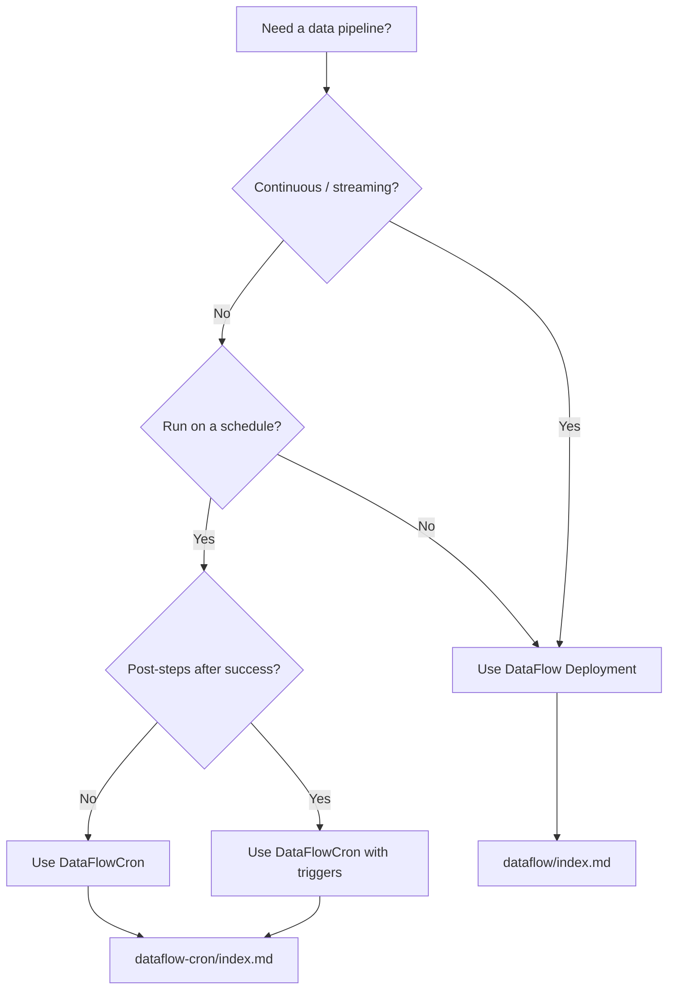

# Workload Types

DataFlow Operator exposes two primary CRDs for running pipelines. Both use the same **Source → Transformations → Sink** processor, but differ in **orchestration** and **lifecycle**.

## Quick comparison

| | **DataFlow** | **DataFlowCron** |
|---|--------------|------------------|
| **Kind** | `DataFlow` | `DataFlowCron` |
| **Workload** | Long-lived **Deployment** | **CronJob** + **Job** per tick |
| **Typical use** | Streaming / continuous sync | Scheduled batch / ETL windows |
| **Processor exit** | Runs until deleted or pod stops | Exits when source is exhausted (polling) or process ends |
| **Post-steps** | — | Optional ordered **`triggers`** (Jobs after success) |
| **Scale-out** | `replicas > 1` for Kafka only | Single processor Job per schedule tick |

## When to use DataFlow

Choose **`DataFlow`** when:

- The pipeline should run **continuously** (Kafka consumer, always-on replication).
- You need **multiple Kafka consumer replicas** in one consumer group.
- There is no natural “end” to a run — the processor keeps reading until the resource is deleted.

See [DataFlow Overview](../dataflow/index.md).

## When to use DataFlowCron

Choose **`DataFlowCron`** when:

- Work is **periodic** (nightly export, hourly aggregation).
- The source is **batch-friendly** (PostgreSQL poll until exhausted, ClickHouse table scan).
- You need **hooks after success** — notify Slack, trigger Airflow, run `kubectl apply`.

!!! warning "Kafka as a cron source"
    Kafka is streaming: a cron-driven Kafka pipeline may never reach “Job succeeded → triggers” unless you design bounded work. Prefer polling sources for scheduled runs with post-triggers.

See [DataFlowCron Overview](../dataflow-cron/index.md).

## Decision flow

## Shared spec fields

`DataFlowCronSpec` **embeds** `DataFlowSpec`. Fields such as `source`, `sink`, `transformations`, `errors`, `resources`, `checkpointPersistence`, and `SecretRef` behave the same in both CRDs.

| Topic | DataFlow doc | DataFlowCron doc |
|-------|--------------|------------------|
| Spec fields | [Spec Reference](../dataflow/spec.md) | [Spec & Schedule](../dataflow-cron/spec.md) |
| Cluster objects | [Lifecycle](../dataflow/lifecycle.md) | [Spec & Schedule — Objects](../dataflow-cron/spec.md#objects-created-in-the-cluster) |
| Triggers | — | [Triggers](../dataflow-cron/triggers.md) |
| Operator internals | [Architecture](../architecture.md) | [Architecture](../architecture.md) |

## See also

- [Architecture](../architecture.md) — operator, processor runtime, webhook
- [Getting Started](../getting-started.md) — install and first pipeline
- [Examples](../examples.md) — YAML samples for both CRDs
