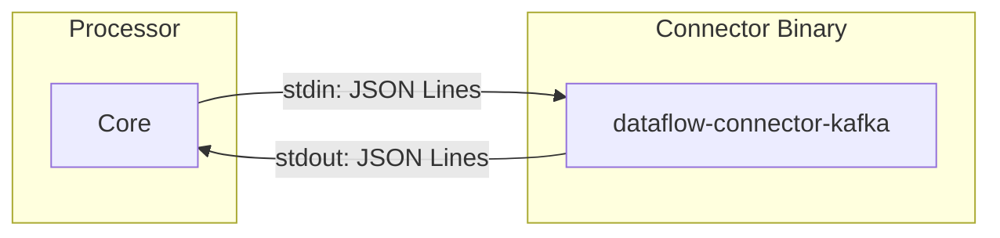

# Connector Protocol (stdin/stdout)

DataFlow supports running connectors as separate binaries that communicate with the processor via **stdin/stdout** using **JSON Lines** (one JSON object per line).

## Overview

When `DATAFLOW_USE_SUBPROCESS_CONNECTORS=1` is set and a connector binary is found (see [Connector Discovery](#connector-discovery)), the processor spawns the binary and exchanges commands and responses over pipes.



## Protocol Format

- **Encoding**: UTF-8
- **Format**: One JSON object per line, newline-separated
- **Direction**: Processor writes to connector stdin, reads from connector stdout
- **Flush**: Processor flushes stdin after each command

## Commands (Processor → Connector)

| cmd | Description | Fields |
|-----|-------------|--------|
| `init` | Initialize with config | `role`, `type`, `config`, `options` |
| `connect` | Establish connection | — |
| `read` | Read messages (source only) | `limit` (optional) |
| `write` | Write messages (sink only) | `messages` |
| `close` | Close connection | — |
| `ping` | Liveness check | — |

## Responses (Connector → Processor)

| type | Description | Fields |
|-----|-------------|--------|
| `ready` | Ready for next command | — |
| `message` | Single message | `data`, `metadata`, `timestamp` |
| `done` | Operation complete | — |
| `error` | Error occurred | `message`, `code` |
| `checkpoint` | Checkpoint data (source) | `data` |
| `pong` | Response to ping | — |

## Message Format (wire)

```json
{
  "data": "{\"id\":1,\"name\":\"foo\"}",
  "metadata": {
    "kafka_partition": 0,
    "kafka_offset": 42
  },
  "timestamp": "2024-01-15T10:30:00Z"
}
```

- `data`: JSON string (raw payload)
- `metadata`: Object (partition, offset, etc.)
- `timestamp`: RFC3339

## Lifecycle

### Source Connector

1. Processor: `{"cmd":"init","role":"source","type":"kafka","config":{...},"options":{...}}`
2. Connector: `{"type":"ready"}`
3. Processor: `{"cmd":"connect"}`
4. Connector: `{"type":"ready"}` or `{"type":"error","message":"..."}`
5. Loop: Processor: `{"cmd":"read"}` → Connector: `{"type":"message",...}` × N, `{"type":"done"}`
6. (Optional) Connector: `{"type":"checkpoint","data":"..."}` for polling sources
7. Processor: `{"cmd":"close"}`
8. Connector: `{"type":"done"}`

### Sink Connector

1. Processor: `{"cmd":"init","role":"sink","type":"kafka","config":{...}}`
2. Connector: `{"type":"ready"}`
3. Processor: `{"cmd":"connect"}`
4. Connector: `{"type":"ready"}`
5. Processor: `{"cmd":"write","messages":[...]}`
6. Connector: `{"type":"done"}` or `{"type":"error","message":"..."}`
7. Processor: `{"cmd":"close"}`
8. Connector: `{"type":"done"}`

## Connector Discovery

The processor searches for connector binaries in this order:

1. **DATAFLOW_CONNECTOR_PATH** — Colon-separated (Unix) or semicolon-separated (Windows) list of directories
2. **./connectors/** — Relative to working directory
3. **/usr/local/lib/dataflow/connectors/**
4. **PATH** — Binary name `dataflow-connector-<type>`

Example:

```bash
export DATAFLOW_CONNECTOR_PATH=/opt/dataflow/connectors:/plugins
export DATAFLOW_USE_SUBPROCESS_CONNECTORS=1
```

## Enabling Subprocess Connectors

Set the environment variable in the processor pod:

```bash
DATAFLOW_USE_SUBPROCESS_CONNECTORS=1
```

Ensure the connector binary is available (in PATH or DATAFLOW_CONNECTOR_PATH). If the binary is not found, the processor falls back to in-process connectors.

## Building Connector Binaries

### dataflow-connector-kafka

```bash
cd dataflow
task build-connector-kafka
# Output: bin/dataflow-connector-kafka
```

Add to PATH or DATAFLOW_CONNECTOR_PATH:

```bash
export PATH="$PATH:$(pwd)/bin"
# or
mkdir -p connectors && cp bin/dataflow-connector-kafka connectors/
```

## See Also

- [Connector Development](connector-development.md) — Adding in-process connectors
- [Subprocess connectors: design notes](subprocess-connectors-design.md) — Goals and tradeoffs only; the wire format on **this** page is authoritative
