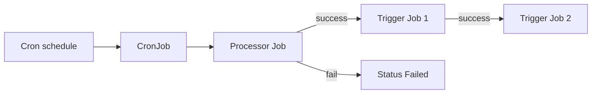

# DataFlowCron

**DataFlowCron** is a namespaced CRD (`dataflowcrons`, kind `DataFlowCron`, group `dataflow.dataflow.io`) for running the same **Source → Transformations → Sink** pipeline as [DataFlow](../dataflow/index.md), but on a **cron schedule** using Kubernetes **CronJob** / **Job** instead of a long-lived Deployment.

Use it when the workload is naturally **batch-oriented** (e.g. poll a table, export a window, then stop) or when you want a **periodic** run with optional **post-processing steps** ([triggers](triggers.md)) after the processor finishes successfully.

## How it differs from DataFlow

| | DataFlow | DataFlowCron |
|---|----------|--------------|
| Orchestration | Deployment (always on) | CronJob → Job per tick |
| Post-run hooks | — | Optional `triggers` chain |
| Best sources | Kafka streaming | Polling / batch sources |

See [Workload Types](../concepts/workload-types.md) for decision guidance.

## Execution flow

1. On each schedule tick, the **CronJob** starts a **Job** whose pod runs the **processor** until the source is exhausted or the process exits.
2. If **`triggers`** is non-empty, after that Job **succeeds**, the operator enqueues **trigger Jobs** in order.
3. **Status** tracks phases such as runs in progress, `RunningTriggers`, **`Completed`**, or **`Failed`**.

## Source types and run completion

- **Polling sources** (PostgreSQL, Trino, ClickHouse, Nessie) typically **finish** when the source is **exhausted**, so the processor Job can complete and triggers can run.
- **Kafka** is **streaming**: the processor often does **not** stop by itself, so a Cron-driven Kafka pipeline may not reach “success → triggers” unless you design for completion. Prefer polling sources for scheduled **post-triggers**.

## Documentation in this section

- [Spec & Schedule](spec.md) — embedded DataFlowSpec, cron fields, cluster objects
- [Triggers](triggers.md) — ordered post-run Jobs, fields, debugging
- [Examples](examples.md) — YAML samples, status, suspend

## See also

- [DataFlow Overview](../dataflow/index.md)
- [Architecture](../architecture.md)
- [Examples](../examples.md#dataflowcron-example)
