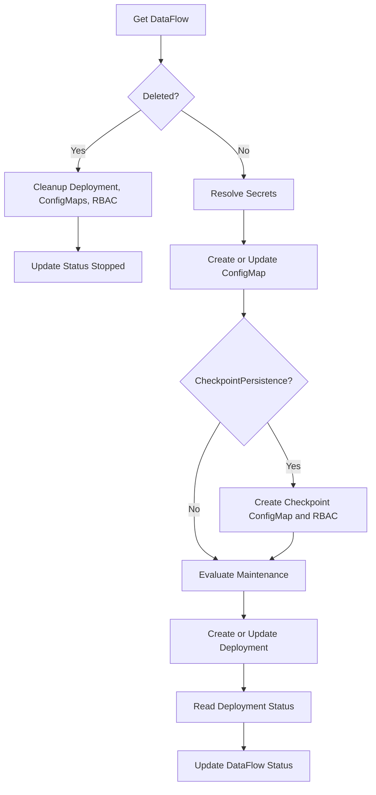

# DataFlow Lifecycle & Status

This page covers **cluster objects**, **reconciliation**, and **status** for the `DataFlow` CRD. For `spec` fields, see [Spec Reference](spec.md).

## Resources created per DataFlow

For each `DataFlow` named `<name>` in a namespace:

| Resource | Name | Purpose |
|----------|------|---------|
| ConfigMap | `df-<name>-spec` | Holds `spec.json` (resolved spec with secrets inlined). |
| ConfigMap | `df-<name>-checkpoint` | Read position for polling sources (default). Omitted when `checkpointPersistence: false`. |
| Deployment | `df-<name>` | Processor pod(s). |
| ServiceAccount, Role, RoleBinding | `df-<name>-processor` | RBAC for checkpoint ConfigMap access. Omitted when `checkpointPersistence: false`. |

### Processor pod

- **Image**: from env `PROCESSOR_IMAGE` (often same as operator image/tag).
- **Args**: `--spec-path=/etc/dataflow/spec.json`, `--namespace=...`, `--name=...`.
- **Volume**: ConfigMap `df-<name>-spec` mounted at `/etc/dataflow` (read-only).
- **Env**: `LOG_LEVEL` (e.g. from `PROCESSOR_LOG_LEVEL`).

The controller sets **owner references** from the DataFlow to owned resources so they are deleted when the DataFlow is deleted.

## Reconciliation loop

For each DataFlow, **DataFlowReconciler** runs:

1. **Get DataFlow** — if deleting, clean up Deployment, ConfigMaps, RBAC; set status `Stopped`.
2. **Resolve secrets** — substitute all `SecretRef` fields via **SecretResolver**.
3. **ConfigMap** — create/update `df-<name>-spec` with `spec.json`.
4. **Checkpoint & RBAC** (when `checkpointPersistence` is not `false`) — create checkpoint ConfigMap and processor RBAC.
5. **Maintenance** — evaluate `spec.maintenance`, update `status.maintenanceStatus`; scale Deployment to **0** replicas when a window is active or `suspended: true`.
6. **Deployment** — create/update `df-<name>` with processor image, volume, resources, affinity.
7. **Deployment status** — map Deployment readiness to DataFlow **Phase** / **Message**.
8. **Update status** — write status back to the DataFlow resource.



## Status fields

Each `DataFlow` resource exposes status including:

| Field | Description |
|-------|-------------|
| **Phase** | e.g. `Running`, `Pending`, `Error`, `Stopped` |
| **Message** | Additional status detail |
| **LastProcessedTime** | Time of last processed message |
| **ProcessedCount** | Messages processed |
| **ErrorCount** | Processing errors |
| **maintenanceStatus** | Maintenance state (see below) |

### maintenanceStatus

| Field | Description |
|-------|-------------|
| **inMaintenance** | `true` when the processor is paused due to an active scheduled window |
| **nextMaintenanceTime** | Start time of the next scheduled window |
| **lastMaintenanceTime** | Start time of the current or most recent window |
| **suspended** | `true` when `spec.maintenance.suspended` is set (manual stop) |

When `inMaintenance` or `suspended` is true, the processor Deployment is scaled to 0 replicas. **Message** may read `Processor paused for scheduled maintenance window` or `Processor suspended manually`.

```bash
kubectl get dataflow
kubectl describe dataflow <name>
kubectl get deployment,configmap -l app.kubernetes.io/instance=<name>
```

See [Metrics](../metrics.md) for Prometheus counters and [Kubernetes Events](../kubernetes-events.md) for cluster events.

## RBAC

The operator **ClusterRole** allows:

- Read/write **DataFlow** and status.
- Create/patch **events**.
- Read **secrets** (for resolution).
- Create/update/delete **ConfigMaps** and **Deployments** in DataFlow namespaces.
- Create **ServiceAccounts**, **Roles**, **RoleBindings** for checkpoint access when enabled.

See Helm templates (`clusterrole.yaml`) for exact rules.

## See also

- [Architecture](../architecture.md) — operator deployment, processor runtime, webhook
- [DataFlow Overview](index.md)
- [DataFlowCron Lifecycle](../dataflow-cron/spec.md#objects-created-in-the-cluster) — CronJob-based runs
