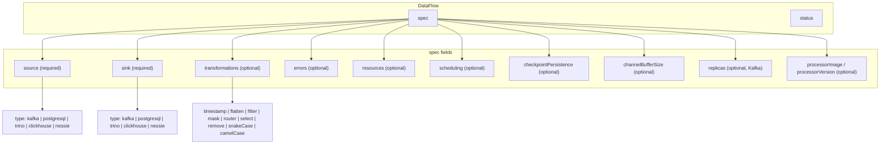

# DataFlow Spec Reference

This page documents the **`DataFlow`** `spec` fields. For orchestration (Deployment, reconciliation, status), see [Lifecycle & Status](lifecycle.md).

## CRD structure

## Field reference

| Field | Required | Description |
|-------|----------|-------------|
| **`source`** | Yes | Source connector type and config. See [Connectors](../connectors.md). |
| **`sink`** | Yes | Main destination connector. |
| **`transformations`** | No | Ordered list of message transformers. See [Transformations](../transformations.md). |
| **`errors`** | No | Optional error sink for failed writes to the main sink. |
| **`resources`** | No | CPU/memory for the processor pod. |
| **`nodeSelector`**, **`affinity`**, **`tolerations`** | No | Pod scheduling constraints. |
| **`checkpointPersistence`** | No | Default `true`. Polling sources persist read position to a ConfigMap. For Nessie, applies when `source.config.incrementalBySnapshot: true`. Set `false` to disable. |
| **`channelBufferSize`** | No | Default `100`. Buffer between source, processor, and sink. Use 500–1000 for high Kafka throughput. |
| **`replicas`** | No | Default `1`. Values **> 1** allowed **only for Kafka** (consumer group). Webhook rejects `replicas > 1` for polling sources. |
| **`processorImage`** / **`processorVersion`** | No | Override processor container image. |
| **`imagePullSecrets`** | No | Pull secrets for the processor pod. |

## Secrets

Credentials can be referenced via **`SecretRef`** in connector config. The operator resolves secrets before writing `spec.json` into the ConfigMap. See [Connectors — Using Kubernetes Secrets](../connectors.md#using-kubernetes-secrets).

## Validation

When the [validating webhook](../development.md#configuring-the-validating-webhook) is enabled (Helm: `webhook.enabled` and `webhook.caBundle`), invalid specs are rejected at admission time — before ConfigMap or Deployment creation.

The same validation rules apply to the embedded `DataFlowSpec` inside **DataFlowCron**.

## See also

- [DataFlow Overview](index.md)
- [Lifecycle & Status](lifecycle.md)
- [DataFlowCron Spec](../dataflow-cron/spec.md) — schedule and cron-specific fields
