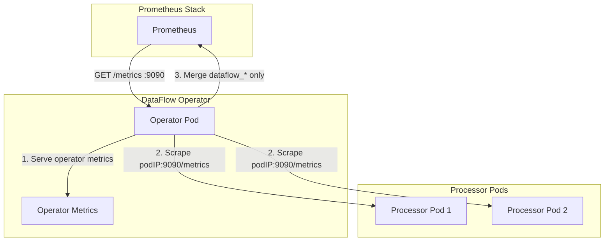

# DataFlow Operator Metrics

DataFlow Operator exports Prometheus metrics for monitoring the operator and data processing.

## How metrics collection works

Prometheus scrapes only the operator Service (port 9090). The operator aggregates metrics from all processor pods.

On each `/metrics` request:

1. The operator returns its own metrics (controller-runtime, `dataflow_status`)
2. It discovers DataFlows and processor pods by labels `app=dataflow-processor`, `dataflow.dataflow.io/name`
3. It fetches `http://<podIP>:9090/metrics` from each processor pod
4. It keeps only `dataflow_*` metrics (drops `go_*`, `process_*`)
5. It merges operator and processor metrics and returns the combined output



## Available metrics

### DataFlow manifest metrics

- `dataflow_messages_received_total` — total number of messages received per manifest
  - Labels: `namespace`, `name`, `source_type`

- `dataflow_messages_sent_total` — total number of messages sent per manifest
  - Labels: `namespace`, `name`, `sink_type`, `route`

- `dataflow_processing_duration_seconds` — message processing time (histogram)
  - Labels: `namespace`, `name`

- `dataflow_status` — DataFlow manifest status (1 = Running, 0 = Stopped/Error)
  - Labels: `namespace`, `name`, `phase`

### Connector metrics

- `dataflow_connector_messages_read_total` — number of messages read from source connector
  - Labels: `namespace`, `name`, `connector_type`, `connector_name`

- `dataflow_connector_messages_written_total` — number of messages written to sink connector
  - Labels: `namespace`, `name`, `connector_type`, `connector_name`, `route`

- `dataflow_connector_errors_total` — number of connector errors
  - Labels: `namespace`, `name`, `connector_type`, `connector_name`, `operation`, `error_type`
  - Possible `error_type` values: see [Error types](errors.md#error-types)

- `dataflow_connector_connection_status` — connector connection status (1 = connected, 0 = disconnected)
  - Labels: `namespace`, `name`, `connector_type`, `connector_name`

### Transformer metrics

- `dataflow_transformer_executions_total` — number of transformer executions
  - Labels: `namespace`, `name`, `transformer_type`, `transformer_index`

- `dataflow_transformer_errors_total` — number of transformer errors
  - Labels: `namespace`, `name`, `transformer_type`, `transformer_index`, `error_type`
  - Possible `error_type` values: see [Error types](errors.md#error-types)

- `dataflow_transformer_duration_seconds` — transformer execution time (histogram)
  - Labels: `namespace`, `name`, `transformer_type`, `transformer_index`

- `dataflow_transformer_messages_in_total` — number of messages input to transformer
  - Labels: `namespace`, `name`, `transformer_type`, `transformer_index`

- `dataflow_transformer_messages_out_total` — number of messages output from transformer
  - Labels: `namespace`, `name`, `transformer_type`, `transformer_index`

### Task execution metrics

- `dataflow_task_stage_duration_seconds` — individual task stage execution time (histogram)
  - Labels: `namespace`, `name`, `stage`
  - Stages: `read`, `transformation`, `write`, `sink_write`, `error_sink_write`, `transformer_0`, `transformer_1`, etc.

- `dataflow_task_message_size_bytes` — message size at different processing stages (histogram)
  - Labels: `namespace`, `name`, `stage`
  - Stages: `input`, `output`, `transformer_0_input`, `transformer_0_output`, etc.

- `dataflow_task_stage_latency_seconds` — latency between processing stages (histogram)
  - Labels: `namespace`, `name`, `from_stage`, `to_stage`

- `dataflow_task_throughput_messages_per_second` — current throughput (messages per second)
  - Labels: `namespace`, `name`

- `dataflow_task_success_rate` — task success rate (0.0 to 1.0)
  - Labels: `namespace`, `name`

- `dataflow_task_end_to_end_latency_seconds` — full message lifetime from receipt to delivery (histogram)
  - Labels: `namespace`, `name`

- `dataflow_task_active_messages` — number of messages currently being processed
  - Labels: `namespace`, `name`

- `dataflow_task_queue_size` — current message queue size
  - Labels: `namespace`, `name`, `queue_type`
  - Queue types: `routing`, `output`, `default`, and router routes

- `dataflow_task_queue_wait_time_seconds` — time messages spend waiting in queue (histogram)
  - Labels: `namespace`, `name`, `queue_type`

- `dataflow_task_operations_total` — total operations by type
  - Labels: `namespace`, `name`, `operation`, `status`
  - Operations: `transform`, `write`, `sink_write`, `error_sink_write`
  - Statuses: `success`, `error`, `cancelled`

- `dataflow_task_stage_errors_total` — number of errors per stage
  - Labels: `namespace`, `name`, `stage`, `error_type`
  - Possible `error_type` values: see [Error types](errors.md#error-types)

### Labels

Metrics use `namespace` and `name` labels to bind to DataFlow, which is convenient for filtering and aggregation in Prometheus/Grafana. All metrics include at least these two labels; additional labels (`source_type`, `sink_type`, `connector_type`, `stage`, etc.) allow for more detailed queries.

Examples:
- Filter by specific DataFlow: `dataflow_messages_received_total{namespace="default", name="my-dataflow"}`
- Aggregate by namespace: `sum(rate(dataflow_messages_received_total[5m])) by (namespace, name)`

### Histograms

Histograms use exponential buckets suitable for latency and message sizes:

| Metric | Buckets | Range |
|--------|---------|-------|
| `dataflow_processing_duration_seconds` | ExponentialBuckets(0.001, 2, 10) | 1 ms — ~1 s |
| `dataflow_transformer_duration_seconds` | ExponentialBuckets(0.0001, 2, 12) | 0.1 ms — ~400 ms |
| `dataflow_task_stage_duration_seconds` | ExponentialBuckets(0.0001, 2, 14) | 0.1 ms — ~1.6 s |
| `dataflow_task_message_size_bytes` | ExponentialBuckets(64, 2, 16) | 64 bytes — ~4 MB |
| `dataflow_task_stage_latency_seconds` | ExponentialBuckets(0.0001, 2, 12) | 0.1 ms — ~400 ms |
| `dataflow_task_end_to_end_latency_seconds` | ExponentialBuckets(0.001, 2, 12) | 1 ms — ~2 s |
| `dataflow_task_queue_wait_time_seconds` | ExponentialBuckets(0.0001, 2, 12) | 0.1 ms — ~400 ms |

- **Latency** (time in seconds): start from 0.1 ms or 1 ms, multiplier 2.
- **Message sizes** (bytes): start from 64 bytes, multiplier 2.

## Monitoring setup

### Prometheus ServiceMonitor

For automatic Prometheus discovery, create a ServiceMonitor:

```yaml
apiVersion: monitoring.coreos.com/v1
kind: ServiceMonitor
metadata:
  name: dataflow-operator
  labels:
    app: dataflow-operator
spec:
  selector:
    matchLabels:
      app: dataflow-operator
  endpoints:
    - port: metrics
      path: /metrics
      interval: 30s
```

Or enable ServiceMonitor in the Helm chart:

```yaml
serviceMonitor:
  enabled: true
  interval: 30s
  scrapeTimeout: 10s
```

### Grafana Dashboard

Import the dashboard from [grafana-dashboard.json](https://github.com/dataflow-operator/dataflow-operator/blob/main/monitoring/dashboards/grafana-dashboard.json) into Grafana to visualize metrics.

**Via Helm chart (ConfigMap):** Enable `monitoring.dashboard.enabled` when installing. The dashboard is bundled in the chart (`dashboards/grafana-dashboard.json`). Grafana sidecar (kube-prometheus-stack) picks up ConfigMaps with label `grafana_dashboard: "1"`.

The dashboard includes:
- Message received/sent rate charts
- Connector and transformer error charts
- Message processing time
- Connector connection status
- DataFlow manifest status
- Transformer statistics

## Prometheus query examples

### Messages per second per manifest

```promql
sum(rate(dataflow_messages_received_total[5m])) by (namespace, name)
```

### Transformer error rate

```promql
sum(rate(dataflow_transformer_errors_total[5m])) by (namespace, name, transformer_type)
/
sum(rate(dataflow_transformer_executions_total[5m])) by (namespace, name, transformer_type)
* 100
```

### p95 message processing time

```promql
histogram_quantile(0.95, sum(rate(dataflow_processing_duration_seconds_bucket[5m])) by (namespace, name, le))
```

### Active DataFlow manifests count

```promql
sum(dataflow_status) by (namespace, name)
```

### Task throughput

```promql
dataflow_task_throughput_messages_per_second
```

### Task success rate

```promql
dataflow_task_success_rate * 100
```

### p95 read stage duration

```promql
histogram_quantile(0.95, sum(rate(dataflow_task_stage_duration_seconds_bucket{stage="read"}[5m])) by (namespace, name, le))
```

### Average input message size

```promql
avg(dataflow_task_message_size_bytes{stage="input"}) by (namespace, name)
```

### p99 end-to-end latency

```promql
histogram_quantile(0.99, sum(rate(dataflow_task_end_to_end_latency_seconds_bucket[5m])) by (namespace, name, le))
```

### Active messages in processing

```promql
dataflow_task_active_messages
```

### Message queue size

```promql
dataflow_task_queue_size
```

### Average queue wait time

```promql
avg(rate(dataflow_task_queue_wait_time_seconds_sum[5m])) by (namespace, name, queue_type)
/
avg(rate(dataflow_task_queue_wait_time_seconds_count[5m])) by (namespace, name, queue_type)
```

### Error rate by stage

```promql
sum(rate(dataflow_task_stage_errors_total[5m])) by (namespace, name, stage)
/
sum(rate(dataflow_task_operations_total[5m])) by (namespace, name)
* 100
```

## Alerts

### Ready-to-use manifests

A PrometheusRule manifest with pre-configured alerts is available in the repository:

- **File:** [monitoring/alerts/prometheusrule.yaml](https://github.com/dataflow-operator/dataflow-operator/blob/main/monitoring/alerts/prometheusrule.yaml)

**Apply the manifest:**

```bash
kubectl apply -f monitoring/alerts/prometheusrule.yaml
```

**Via Helm chart:** Enable `monitoring.prometheusRule.enabled` and set `monitoring.prometheusRule.additionalLabels` (e.g. `release: kube-prometheus-stack`) to match your Prometheus ruleSelector.

**Requirements:** Prometheus Operator (e.g. kube-prometheus-stack). The `release: kube-prometheus-stack` label must match your Prometheus instance's ruleSelector. Adjust the label if you use a different Prometheus deployment.

| Alert | Description |
|-------|-------------|
| DataFlowInError | DataFlow is in Error state |
| DataFlowConnectorDisconnected | Connector is disconnected |
| DataFlowHighErrorRate | Error rate (connector + transformer) > 1% |
| DataFlowSlowProcessing | p95 message processing duration > 1s |
| DataFlowLowTaskSuccessRate | Task success rate < 95% |
| DataFlowHighQueueSize | Queue size > 1000 messages |
| DataFlowHighE2ELatency | p99 end-to-end latency > 5s |

### Additional queries

Use these PromQL expressions for custom dashboards or ad-hoc alerts:

**High error rate**

```promql
(
  sum(rate(dataflow_connector_errors_total[5m])) by (namespace, name)
  + sum(rate(dataflow_transformer_errors_total[5m])) by (namespace, name)
)
/
sum(rate(dataflow_messages_received_total[5m])) by (namespace, name)
> 0.01
```

**Disconnected connectors**

```promql
dataflow_connector_connection_status == 0
```

**DataFlow in Error or Stopped**

```promql
dataflow_status{phase=~"Error|Stopped"} == 1
```
