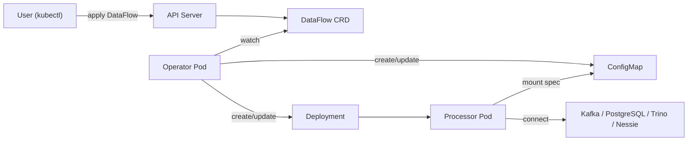
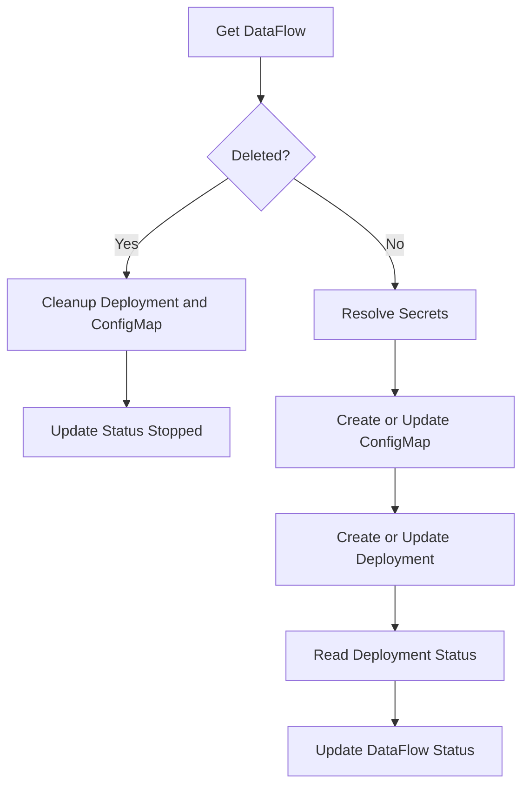
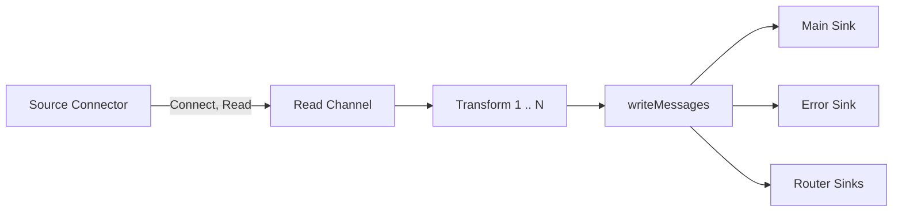

# Архитектура

В этом разделе описано, как работает DataFlow Operator: его роль в Kubernetes, цикл реконсиляции и поток данных в рантайме внутри каждого процессора.

## Обзор

DataFlow Operator обеспечивает **декларативное управление потоками данных** через пользовательский ресурс Kubernetes (CRD). Вы описываете ресурс **DataFlow** с источником, опциональными трансформациями и приёмником; оператор создаёт и поддерживает **процессор** — под, который непрерывно читает из источника, применяет трансформации и пишет в приёмник (и при необходимости в приёмник ошибок).

Общая схема:

1. Вы создаёте или обновляете **DataFlow** (например, через `kubectl apply`).
2. **Оператор** следит за ресурсами DataFlow и для каждого создаёт или обновляет **ConfigMap** (с подставленным spec) и **Deployment** (один под с бинарником процессора).
3. **Под процессора** читает spec из смонтированного ConfigMap, подключается к источнику и приёмнику(ам) и выполняет конвейер: чтение → трансформация → запись.

## Архитектура в Kubernetes

### Custom Resource Definition (CRD)

- **API group**: `dataflow.dataflow.io`
- **Ресурс**: `dataflows` (kind `DataFlow`), **namespaced**.
- **Spec** включает:
  - **Source**: тип (например `kafka`, `postgresql`, `trino`) и конфигурацию (брокеры, топик, строка подключения и т.д.).
  - **Sink**: тип и конфигурация основного приёмника.
  - **Transformations**: упорядоченный список трансформаций (timestamp, flatten, filter, mask, router, select, remove, snakeCase, camelCase и др.).
  - **Errors**: опциональный приёмник для сообщений, которые не удалось записать в основной.
  - **Resources**: опциональные CPU/память для пода процессора.
  - **Scheduling**: опционально `nodeSelector`, `affinity`, `tolerations`.

Секреты задаются через `SecretRef` в spec; оператор подставляет их перед записью spec в ConfigMap.

### Deployment оператора

Оператор работает как один **Deployment** в кластере (например, установленный через Helm). Он использует **controller-runtime** и один контроллер **DataFlowReconciler**, который реконсилирует ресурсы `DataFlow`. Включено **Leader election** (ID `dataflow-operator.dataflow.io`): при нескольких репликах только один активный лидер выполняет цикл реконсиляции (высокая доступность).

### Контроллер

**DataFlowReconciler**:

- **Следит за**: `DataFlow` (основной ресурс), **владеет** объектами `Deployment` и `ConfigMap` для каждого DataFlow (их жизненный цикл привязан к DataFlow).
- Опционально следит за **собственным Deployment оператора** (когда заданы `OPERATOR_DEPLOYMENT_NAME` и `OPERATOR_NAMESPACE`). При обновлении этого Deployment (например, новый образ) контроллер запускает реконсиляцию **всех** DataFlow, чтобы поды процессоров могли перейти на новый образ процессора.

### Ресурсы на один DataFlow

Для каждого DataFlow с именем `<name>` в namespace создаются:

| Ресурс | Имя | Назначение |
|--------|-----|------------|
| ConfigMap | `dataflow-<name>-spec` | Хранит `spec.json` (spec с подставленными секретами). |
| Deployment | `dataflow-<name>` | Одна реплика; под запускает контейнер **processor**. |

Контейнер процессора:

- Образ: из переменной окружения `PROCESSOR_IMAGE` (часто тот же образ и тег, что и у оператора).
- Аргументы: `--spec-path=/etc/dataflow/spec.json`, `--namespace=...`, `--name=...`.
- Том: ConfigMap `dataflow-<name>-spec` смонтирован в `/etc/dataflow` (только чтение).
- Переменные: `LOG_LEVEL` (например из `PROCESSOR_LOG_LEVEL`).

Контроллер выставляет **owner reference** от DataFlow к ConfigMap и Deployment, чтобы при удалении DataFlow эти объекты тоже удалялись.

### RBAC

Оператор использует **ClusterRole** (и **ClusterRoleBinding** на свой ServiceAccount) с правами на:

- Чтение/запись **DataFlow** и статуса (CRD).
- Создание/обновление **events**.
- Чтение **secrets** (для подстановки).
- Создание/обновление/удаление **ConfigMap** и **Deployment** в тех же namespace, где находятся DataFlow.

Точные правила заданы в Helm-шаблонах (например `clusterrole.yaml`, `clusterrolebinding.yaml`) и манифестах в `config/rbac/`.

### Опционально: GUI

Helm-чарт может развернуть опциональный **GUI** (отдельный Deployment, Service и при необходимости Ingress) для просмотра и управления потоками данных. Он не входит в ядро архитектуры оператора и процессора.

### Admission Webhook (Validating)

Оператор может принимать запросы **Validating Admission Webhook**: при создании или обновлении ресурса DataFlow API-сервер Kubernetes отправляет объект оператору на порт 9443; оператор проверяет spec (типы source/sink, наличие обязательных полей, допустимые трансформации и т.д.) и либо разрешает операцию, либо отклоняет её с понятным сообщением об ошибке.

**Зачем это нужно:** без webhook некорректный spec (неверный тип source/sink, пустые обязательные поля, неизвестная трансформация) приведёт к ошибке только **в рантайме** — когда контроллер уже создал ConfigMap и Deployment, а процессор при старте не смог построить коннектор или трансформацию. Пользователь увидит ошибку в статусе DataFlow или в логах пода, а не при `kubectl apply`. С включённым webhook невалидный spec отклоняется **до записи в etcd**: `kubectl apply` и GUI получают ответ 4xx с текстом ошибки, в кластере не появляются лишние объекты и не создаётся под процессора с заведомо нерабочей конфигурацией.

**Опциональность:** webhook включается только на уровне Helm (value `webhook.enabled`). По умолчанию он выключен: ValidatingWebhookConfiguration не создаётся, API-сервер не вызывает оператор при create/update DataFlow — поведение как раньше. Подробная настройка (TLS, caBundle, включение в production) описана в разделе [Настройка Validating Webhook](development.md#настройка-validating-webhook) руководства по разработке.

---

## Схема архитектуры в Kubernetes

На схеме показано взаимодействие пользователя, API server, оператора и подов процессора.

---

## Цикл реконсиляции

Для каждого DataFlow контроллер выполняет следующие шаги (при создании, обновлении или изменении принадлежащих ресурсов):

1. **Получить DataFlow**  
   Если ресурс не найден — выйти. Если задан **DeletionTimestamp**: удалить Deployment и ConfigMap (очистка), обновить статус на `Stopped` и выйти.

2. **Подставить секреты**  
   **SecretResolver** подставляет все поля с `SecretRef` в spec значениями из Kubernetes Secrets. Результат: **resolved spec**.

3. **ConfigMap**  
   Создать или обновить ConfigMap `dataflow-<name>-spec` с ключом `spec.json` = JSON resolved spec. Установить controller reference на DataFlow.

4. **Deployment**  
   Создать или обновить Deployment `dataflow-<name>`: образ процессора, том из этого ConfigMap, аргументы и переменные окружения как выше. Ресурсы и affinity из spec DataFlow, если заданы. Установить controller reference на DataFlow.

5. **Статус Deployment**  
   Прочитать Deployment; выставить в статусе DataFlow **Phase** и **Message** по нему (например `Running` при `ReadyReplicas > 0`, `Pending` при запуске реплик, `Error` при отсутствии реплик).

6. **Обновить статус DataFlow**  
   Записать Phase, Message и остальные поля статуса в ресурс DataFlow (с повторными попытками при конфликте).

### Схема цикла реконсиляции

---

## Процессор данных (рантайм)

**Процессор** — компонент, который перемещает данные: читает из источника, применяет трансформации и пишет в приёмник(и). Он работает в поде, созданном оператором.

### Точка входа

Бинарник процессора (собирается из `cmd/processor/main.go`) запускается с аргументами:

- `--spec-path` (по умолчанию `/etc/dataflow/spec.json`)
- `--namespace`, `--name` (namespace и имя DataFlow для логов и метрик)

Он читает spec из файла, строит по нему **Processor** и вызывает `Processor.Start(ctx)` до отмены контекста (например по SIGTERM).

### Структура процессора

**Processor** (в `internal/processor/processor.go`) строится из spec и содержит:

- **Source**: **SourceConnector** (Kafka, PostgreSQL, Trino или Nessie) — `Connect`, `Read`, `Close`.
- **Sink**: **SinkConnector** основного приёмника — `Connect`, `Write`, `Close`.
- **Error sink** (опционально): ещё один SinkConnector для неудачных записей.
- **Transformations**: упорядоченный список реализаций **Transformer** (timestamp, flatten, filter, mask, router, select, remove, snakeCase, camelCase).
- **Router sinks**: при использовании трансформации `router` — отображение условие → **SinkSpec** для динамических приёмников.

Коннекторы создаются фабрикой из `spec.Source`, `spec.Sink` (и `spec.Errors`); см. `internal/connectors/`.

### Поток выполнения

1. **Подключение**  
   `source.Connect(ctx)`, затем `sink.Connect(ctx)`, при необходимости `errorSink.Connect(ctx)`.

2. **Чтение**  
   `source.Read(ctx)` возвращает канал **Message** (каждое сообщение — payload и опциональные метаданные, например `routed_condition` от router).

3. **Обработка**  
   Горутина **processMessages**: для каждого сообщения из канала по порядку применяются **трансформации**. Каждая трансформация принимает одно или несколько сообщений и возвращает одно или несколько (filter отбрасывает, flatten может порождать несколько, router добавляет `routed_condition` и может направлять по разным маршрутам). Результат отправляется во внутренний канал.

4. **Запись**  
   **writeMessages** читает из этого канала:
   - Если заданы **router**-приёмники: сообщения распределяются по метаданным в соответствующий приёмник маршрута или в приёмник по умолчанию (основной); для каждого маршрута может создаваться свой коннектор (по требованию).
   - Иначе: все сообщения идут в основной приёмник.
   - При ошибке записи, если задан **error sink**, неудачное сообщение может быть отправлено туда.

Интерфейсы коннекторов описаны в `internal/connectors/interface.go`: **SourceConnector** (Connect, Read, Close), **SinkConnector** (Connect, Write, Close).

### Коннекторы и трансформации

- **Типы source/sink**: Kafka, PostgreSQL, Trino, Nessie (выбор по `spec.source.type` и `spec.sink.type`).
- **Трансформации** (порядок задаётся в spec): timestamp, flatten, filter, mask, router, select, remove, snakeCase, camelCase.

### Поток данных в процессоре (схема)

---

## Кратко

- **Kubernetes**: вы объявляете ресурс **DataFlow**; **оператор** приводит его к **ConfigMap** (spec) и **Deployment** (под процессора). RBAC и опциональный GUI дополняют картину.
- **Реконсиляция**: получить DataFlow → подставить секреты → обновить ConfigMap → обновить Deployment → отразить статус Deployment в статусе DataFlow.
- **Рантайм**: каждый **под процессора** выполняет один конвейер: источник → канал чтения → трансформации → запись в основной (и при необходимости в приёмник ошибок и маршруты router), с подключаемыми коннекторами и фиксированным набором трансформаций.
