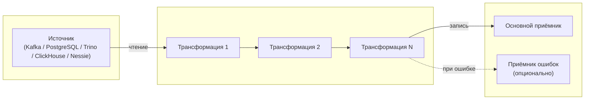
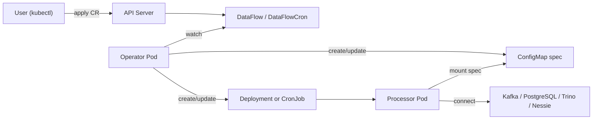

# Архитектура

Как работает DataFlow Operator: роль в Kubernetes, модель реконсиляции и поток данных в процессоре.

## Обзор

Оператор обеспечивает **декларативное управление конвейерами** через Kubernetes CR. Два CRD оркестрируют конвейеры по-разному:

| CRD | Workload | Документация |
|-----|----------|--------------|
| **DataFlow** | Постоянный Deployment | [DataFlow](dataflow/index.md) |
| **DataFlowCron** | CronJob + Job на тик | [DataFlowCron](dataflow-cron/index.md) |

См. [Типы нагрузки](concepts/workload-types.md).

Для **DataFlow**:

1. `kubectl apply` создаёт или обновляет ресурс.
2. Оператор создаёт **ConfigMap** и **Deployment**.
3. Под процессора выполняет: чтение → трансформация → запись.

### Поток данных (концептуально) { #поток-данных-концептуально }

**Источник** → **Трансформации** → **Приёмник** (опционально **Приёмник ошибок**).

```mermaid
flowchart LR
  subgraph Input[" "]
    Source["Источник\n(Kafka / PostgreSQL / Trino / ClickHouse / Nessie)"]
  end

  subgraph Transform[" "]
    T1["Трансформация 1"]
    T2["Трансформация 2"]
    TN["Трансформация N"]
    T1 --> T2 --> TN
  end

  subgraph Output[" "]
    MainSink["Основной приёмник"]
    ErrSink["Приёмник ошибок\n(опционально)"]
  end

  Source -->|"чтение"| T1
  TN -->|"запись"| MainSink
  TN -.->|"при ошибке"| ErrSink
```

## Архитектура в Kubernetes

### Custom Resources

- **API group**: `dataflow.dataflow.io`
- **`DataFlow`** — см. [Spec](dataflow/spec.md), [Жизненный цикл](dataflow/lifecycle.md).
- **`DataFlowCron`** — см. [Spec](dataflow-cron/spec.md), [Триггеры](dataflow-cron/triggers.md).

Секреты через `SecretRef`; оператор подставляет их перед записью в ConfigMap.

### Deployment оператора

**controller-runtime**, **DataFlowReconciler** и **DataFlowCronReconciler**, **Leader election** (`dataflow-operator.dataflow.io`).

### Admission Webhook (Validating) { #admission-webhook-validating }

При включении валидирует **DataFlow** и **DataFlowCron** на порту 9443 до записи в etcd. См. [Настройка Validating Webhook](development.md#настройка-validating-webhook).

---

## Схема в Kubernetes

```mermaid
flowchart LR
  User["User (kubectl)"]
  API["API Server"]
  CRD["DataFlow / DataFlowCron"]
  Operator["Operator Pod"]
  CMSpec["ConfigMap spec"]
  Workload["Deployment or CronJob"]
  Proc["Processor Pod"]
  Ext["Kafka / PostgreSQL / Trino / Nessie"]

  User -->|"apply CR"| API
  API --> CRD
  Operator -->|watch| CRD
  Operator -->|create/update| CMSpec
  Operator -->|create/update| Workload
  Workload --> Proc
  Proc -->|mount spec| CMSpec
  Proc -->|connect| Ext
```

---

## Процессор данных (рантайм)

**Процessor** читает из источника, применяет трансформации, пишет в приёмник(и). Одинаковый бинарник для Deployment и CronJob Job.

### Структура

- **Source**, **Sink**, **Error sink**, **Transformations**, **Router sinks**
- Checkpoint для polling-источников при `checkpointPersistence: true`

### Поток

Connect → Read → Process (трансформации) → Write (main / router / error sink).

Subprocess-коннекторы: `DATAFLOW_USE_SUBPROCESS_CONNECTORS=1` — см. [Протокол коннекторов](connector-protocol.md).

---

## Кратко

- **DataFlow**: ConfigMap + Deployment, непрерывная работа.
- **DataFlowCron**: ConfigMap + CronJob, прогон по расписанию, опциональные trigger Job.
- **Рантайм**: один конвейер процессора.

## См. также

- [DataFlow](dataflow/index.md) · [DataFlowCron](dataflow-cron/index.md)
- [Начало работы](getting-started.md)
