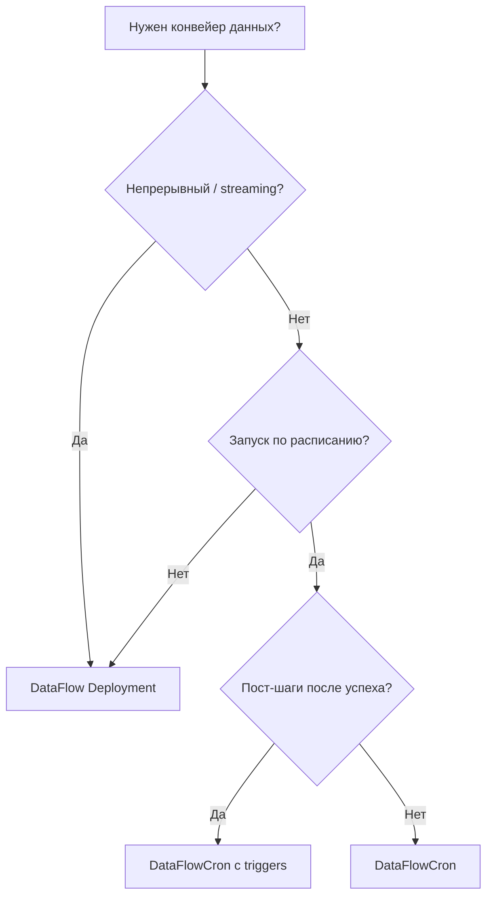

# Типы нагрузки

DataFlow Operator предоставляет два основных CRD для запуска конвейеров. Оба используют один и тот же процессор **источник → трансформации → приёмник**, но отличаются **оркестрацией** и **жизненным циклом**.

## Краткое сравнение

| | **DataFlow** | **DataFlowCron** |
|---|--------------|------------------|
| **Kind** | `DataFlow` | `DataFlowCron` |
| **Workload** | Постоянный **Deployment** | **CronJob** + **Job** на каждый тик |
| **Типичное применение** | Потоковая / непрерывная синхронизация | Пакетный ETL по расписанию |
| **Завершение процессора** | Работает до удаления ресурса | Завершается при исчерпании источника (polling) |
| **Пост-шаги** | — | Опциональные **`triggers`** (Job после успеха) |
| **Масштабирование** | `replicas > 1` только для Kafka | Один Job процессора на тик расписания |

## Когда использовать DataFlow

Выбирайте **`DataFlow`**, если:

- Конвейер должен работать **непрерывно** (consumer Kafka, постоянная репликация).
- Нужны **несколько реплик** consumer group Kafka.
- Нет естественного «конца» прогона.

См. [Обзор DataFlow](../dataflow/index.md).

## Когда использовать DataFlowCron

Выбирайте **`DataFlowCron`**, если:

- Работа **периодическая** (ночная выгрузка, почасовая агрегация).
- Источник **пакетный** (опрос PostgreSQL до исчерпания).
- После успеха нужны **хуки** — Slack, Airflow, `kubectl apply`.

!!! warning "Kafka как источник cron"
    Kafka — потоковый источник: cron-конвейер может никогда не дойти до «Job succeeded → triggers». Для расписания с пост-триггерами используйте polling-источники.

См. [Обзор DataFlowCron](../dataflow-cron/index.md).

## Схема выбора

## Общие поля spec

`DataFlowCronSpec` **встраивает** `DataFlowSpec`. Поля `source`, `sink`, `transformations`, `errors`, `resources`, `checkpointPersistence` и `SecretRef` работают одинаково.

| Тема | DataFlow | DataFlowCron |
|------|----------|--------------|
| Поля spec | [Справочник spec](../dataflow/spec.md) | [Spec и расписание](../dataflow-cron/spec.md) |
| Объекты в кластере | [Жизненный цикл](../dataflow/lifecycle.md) | [Spec — объекты](../dataflow-cron/spec.md#объекты-в-кластере) |
| Триггеры | — | [Триггеры](../dataflow-cron/triggers.md) |

## См. также

- [Архитектура](../architecture.md)
- [Начало работы](../getting-started.md)
- [Примеры](../examples.md)
