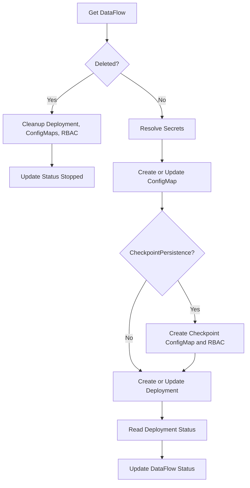

# Жизненный цикл и status DataFlow

Объекты в кластере, **реконсиляция** и **status** для CRD `DataFlow`. Поля spec — в [Справочник spec](spec.md).

## Ресурсы на один DataFlow

Для `DataFlow` с именем `<name>` в namespace:

| Ресурс | Имя | Назначение |
|--------|-----|------------|
| ConfigMap | `df-<name>-spec` | `spec.json` с подставленными секретами. |
| ConfigMap | `df-<name>-checkpoint` | Позиция чтения (по умолчанию). Не создаётся при `checkpointPersistence: false`. |
| Deployment | `df-<name>` | Под(ы) процессора. |
| ServiceAccount, Role, RoleBinding | `df-<name>-processor` | RBAC для checkpoint. Не создаётся при `checkpointPersistence: false`. |

Контроллер выставляет **owner reference**, чтобы owned-ресурсы удалялись вместе с DataFlow.

## Цикл реконсиляции

**DataFlowReconciler**:

1. Получить DataFlow — при удалении очистить Deployment, ConfigMaps, RBAC; status `Stopped`.
2. Подставить секреты через **SecretResolver**.
3. Создать/обновить `df-<name>-spec`.
4. При включённом checkpoint — ConfigMap checkpoint и RBAC.
5. Создать/обновить Deployment `df-<name>`.
6. Отразить статус Deployment в Phase/Message DataFlow.
7. Записать status в ресурс.



## Поля status

| Поле | Описание |
|------|----------|
| **Phase** | `Running`, `Pending`, `Error`, `Stopped` и др. |
| **Message** | Дополнительная информация |
| **LastProcessedTime** | Время последнего сообщения |
| **ProcessedCount** | Обработано сообщений |
| **ErrorCount** | Ошибки |

```bash
kubectl get dataflow
kubectl describe dataflow <name>
```

См. [Метрики](../metrics.md) и [События Kubernetes](../kubernetes-events.md).

## См. также

- [Архитектура](../architecture.md)
- [DataFlowCron — объекты](../dataflow-cron/spec.md#объекты-в-кластере)
