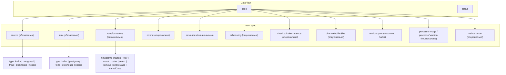

# Справочник spec DataFlow

Описание полей **`DataFlow`** `spec`. Оркестрация (Deployment, реконсиляция, status) — в [Жизненный цикл и status](lifecycle.md).

## Структура CRD



## Поля spec { #поля-spec }

| Поле | Обязательность | Описание |
|------|----------------|----------|
| **`source`** | Да | Тип и конфигурация источника. См. [Коннекторы](../connectors.md). |
| **`sink`** | Да | Основной приёмник. |
| **`transformations`** | Нет | Упорядоченный список трансформаций. См. [Трансформации](../transformations.md). |
| **`errors`** | Нет | Error sink для неудачных записей. |
| **`resources`** | Нет | CPU/память для пода процессора. |
| **`nodeSelector`**, **`affinity`**, **`tolerations`** | Нет | Планирование пода. |
| **`checkpointPersistence`** | Нет | По умолчанию `true`. Для Nessie — при `incrementalBySnapshot: true`. |
| **`channelBufferSize`** | Нет | По умолчанию `100`. Для высокой нагрузки Kafka — 500–1000. |
| **`replicas`** | Нет | По умолчанию `1`. **> 1** только для Kafka. |
| **`processorImage`** / **`processorVersion`** | Нет | Образ процессора. |
| **`imagePullSecrets`** | Нет | Pull secrets для пода. |
| **`maintenance`** | Нет | Окна обслуживания и ручная приостановка процессора. См. [ниже](#окна-обслуживания-maintenance). |

## Окна обслуживания (maintenance) { #окна-обслуживания-maintenance }

Секция **`spec.maintenance`** задаёт расписание окон обслуживания и ручную приостановку. Пока окно активно или `suspended: true`, оператор масштабирует Deployment процессора до **0** реплик. Состояние отражается в `status.maintenanceStatus` — см. [Жизненный цикл и status](lifecycle.md#поля-status).

| Поле | Обязательность | Описание |
|------|----------------|----------|
| **`startTime`** | При расписании | Начало окна в формате RFC3339 (напр. `2024-01-01T02:00:00Z`). |
| **`duration`** | При расписании | Длительность окна в формате Go duration (напр. `2h`, `30m`). |
| **`repeat`** | Нет | Повтор: `daily`, `weekly`, `monthly`. Пустое значение — одноразовое окно. |
| **`timezone`** | Нет | IANA timezone (напр. `Europe/Moscow`). По умолчанию UTC. |
| **`description`** | Нет | Текстовое описание окна. |
| **`suspended`** | Нет | `true` — ручная остановка процессора (аналог кнопки «Остановить» в GUI). |

Поля **`startTime`** и **`duration`** задаются вместе. Validating webhook проверяет формат RFC3339, корректность duration и timezone.

```yaml
spec:
  maintenance:
    startTime: "2024-01-01T02:00:00Z"
    duration: "2h"
    repeat: daily
    timezone: Europe/Moscow
    description: "Ночное обслуживание БД"
```

Ручная приостановка без расписания:

```yaml
spec:
  maintenance:
    suspended: true
```

Управление через [Web GUI](../gui.md): кнопки Stop/Start для отдельного потока, Stop all / Start all для namespace.

## Секреты

Credentials через **`SecretRef`** — см. [Коннекторы — Secrets](../connectors.md#использование-secrets-в-kubernetes).

## Валидация

При включённом [validating webhook](../development.md#настройка-validating-webhook) невалидный spec отклоняется на admission.

Те же правила применяются к встроенному `DataFlowSpec` в **DataFlowCron**.

## См. также

- [Обзор DataFlow](index.md)
- [Spec DataFlowCron](../dataflow-cron/spec.md)
