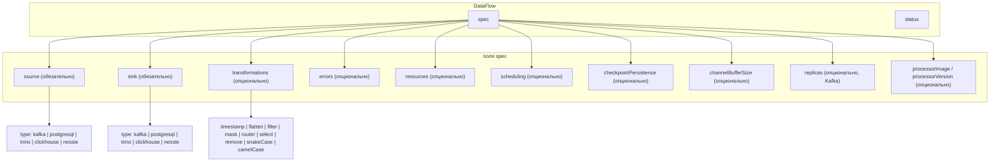

# Справочник spec DataFlow

Описание полей **`DataFlow`** `spec`. Оркестрация (Deployment, реконсиляция, status) — в [Жизненный цикл и status](lifecycle.md).

## Структура CRD

## Поля spec { #поля-spec }

| Поле | Обязательность | Описание |
|------|----------------|----------|
| **`source`** | Да | Тип и конфигурация источника. См. [Коннекторы](../connectors.md). |
| **`sink`** | Да | Основной приёмник. |
| **`transformations`** | Нет | Упорядоченный список трансформаций. См. [Трансформации](../transformations.md). |
| **`errors`** | Нет | Error sink для неудачных записей. |
| **`resources`** | Нет | CPU/память для пода процессора. |
| **`nodeSelector`**, **`affinity`**, **`tolerations`** | Нет | Планирование пода. |
| **`checkpointPersistence`** | Нет | По умолчанию `true`. Для Nessie — при `incrementalBySnapshot: true`. |
| **`channelBufferSize`** | Нет | По умолчанию `100`. Для высокой нагрузки Kafka — 500–1000. |
| **`replicas`** | Нет | По умолчанию `1`. **> 1** только для Kafka. |
| **`processorImage`** / **`processorVersion`** | Нет | Образ процессора. |
| **`imagePullSecrets`** | Нет | Pull secrets для пода. |

## Секреты

Credentials через **`SecretRef`** — см. [Коннекторы — Secrets](../connectors.md#использование-secrets-в-kubernetes).

## Валидация

При включённом [validating webhook](../development.md#настройка-validating-webhook) невалидный spec отклоняется на admission.

Те же правила применяются к встроенному `DataFlowSpec` в **DataFlowCron**.

## См. также

- [Обзор DataFlow](index.md)
- [Spec DataFlowCron](../dataflow-cron/spec.md)
