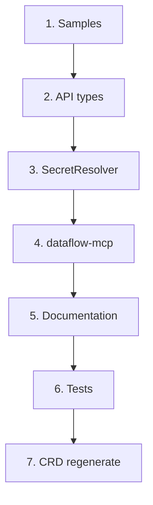

# План миграции на формат `config` и отказ от legacy-формата

> **STATUS: COMPLETED (v1.0.4)**
> Миграция выполнена. Legacy-формат удалён. См. CHANGELOG v1.0.4.

## Цель

Перейти на единый формат конфигурации: `type` + `config` для source, sink и transformations. Удалить поддержку legacy-формата (`type` + `kafka`, `type` + `postgresql`, `type` + `timestamp` и т.д.).

**Целевой формат:**
```yaml
source:
  type: kafka
  config:
    brokers: [...]
    topic: "..."
    consumerGroup: "..."
```

**Удаляемый формат:**
```yaml
source:
  type: kafka
  kafka:  # устаревший
    brokers: [...]
    topic: "..."
```

---

## 1. API types (Go)

### 1.1 dataflow_legacy/api/v1/dataflow_types.go

| Изменение | Детали |
|-----------|--------|
| **SourceSpec** | Удалить поля `Kafka`, `PostgreSQL`, `Trino`, `ClickHouse`, `Nessie`. Удалить `sourceSpecRaw` и кастомный `UnmarshalJSON`. Оставить только `Type` + `Config`. |
| **SinkSpec** | Удалить поля `Kafka`, `PostgreSQL`, `Trino`, `ClickHouse`, `Nessie`. Удалить `sinkSpecRaw` и кастомный `UnmarshalJSON`. |
| **TransformationSpec** | Удалить `transformationSpecRaw`, legacy-поля (`Timestamp`, `Flatten`, `Filter`, `Router`, `Select`, `Remove`, `SnakeCase`, `CamelCase`). Удалить кастомный `UnmarshalJSON`. |

### 1.2 dataflow/api/v1/dataflow_types.go

Аналогичные изменения (структура совпадает с dataflow_legacy).

### 1.3 dataflow-processor/internal/spec/spec.go

| Изменение | Детали |
|-----------|--------|
| **SourceSpec/SinkSpec** | Удалить поля `Kafka`, `PostgreSQL`, `Trino`, `ClickHouse`, `Nessie`. Удалить кастомный `UnmarshalJSON` и fallback в `Get*Config` (`if s.Kafka != nil && len(s.Config) == 0`). |
| **TransformationSpec** | Удалить legacy-поля и кастомный `UnmarshalJSON`. |

### 1.4 DeepCopy (zz_generated.deepcopy.go)

Удалить обработку legacy-полей в `SourceSpec.DeepCopyInto` и `SinkSpec.DeepCopyInto`. Запустить `controller-gen` для регенерации.

---

## 2. SecretResolver — удаление fallback

### 2.1 dataflow_legacy/internal/controller/secrets.go

Удалить блоки fallback (когда Config пустой, заполнять из Kafka/PostgreSQL и т.д.) в:
- `resolveSourceSpec`
- `resolveSinkSpec`
- `resolveSinkSpecRecursive`
- `resolveRouterSinks` (fallback для routeSink)

### 2.2 dataflow/internal/controller/secrets.go

Аналогично удалить fallback.

### 2.3 Тесты

- Удалить `TestSecretResolver_ResolveDataFlowSpec_FallbackFromLegacySource` из обоих пакетов.
- Удалить использование `Kafka`, `PostgreSQL` в тестах — использовать только `Config`.

---

## 3. Samples (манифесты)

### 3.1 dataflow_legacy/config/samples/ (15 файлов)

| Файл | Текущий формат | Изменение |
|------|----------------|-----------|
| kafka-to-postgres.yaml | source.kafka, sink.postgresql | → config |
| kafka-to-postgres-with-resources.yaml | то же | → config |
| kafka-to-postgres-with-errors.yaml | source, sink, errors | → config |
| kafka-to-postgres-secrets.yaml | то же | → config |
| kafka-to-clickhouse.yaml | source.kafka, sink.clickhouse | → config |
| kafka-to-trino.yaml | source.kafka, sink.trino | → config |
| kafka-to-trino-token.yaml | то же | → config |
| kafka-to-trino-secrets.yaml | то же | → config |
| clickhouse-to-clickhouse.yaml | source/sink.clickhouse | → config |
| clickhouse-to-clickhouse2.yaml | то же | → config |
| pg-to-pg-test.yaml | source/sink.postgresql | → config |
| pg-to-pg-test2.yaml | то же | → config |
| postgres-to-kafka-router.yaml | source, sink, transformations (timestamp, router) | → config |
| router-example.yaml | source, sink, transformations (router) | → config |
| flatten-example.yaml | source, sink, transformations (flatten, timestamp) | → config |

**Пример transformations:**
```yaml
# Было:
transformations:
  - type: flatten
    flatten:
      field: rowsStock
  - type: timestamp
    timestamp:
      fieldName: created_at

# Станет:
transformations:
  - type: flatten
    config:
      field: rowsStock
  - type: timestamp
    config:
      fieldName: created_at
```

### 3.2 dataflow/config/samples/

| Файл | Статус |
|------|--------|
| kafka-to-trino-secrets.yaml | legacy → config |
| kafka-to-postgres-secrets.yaml | legacy → config |
| Остальные | уже config |

---

## 4. dataflow-mcp (Rust)

### 4.1 types.rs

```rust
// Было:
pub struct ParsedSource {
    pub type_: Option<String>,
    pub kafka: Option<serde_json::Value>,
    pub postgresql: Option<serde_json::Value>,
    pub trino: Option<serde_json::Value>,
    pub clickhouse: Option<serde_json::Value>,
}

// Станет:
pub struct ParsedSource {
    pub type_: Option<String>,
    pub config: Option<serde_json::Value>,
}
```

Аналогично для `ParsedSink`. Добавить `nessie` в SOURCE_TYPES/SINK_TYPES при необходимости.

### 4.2 manifest.rs

- **generate_dataflow_manifest**: `source.insert("config", Value::Object(source_config_obj))` вместо `source.insert(source_type, ...)`.
- **validate_dataflow_manifest**: проверять `source.config.is_none()` вместо `source.kafka.is_none()` и т.д. Сообщения: `"spec.source.config is required when source.type is kafka"`.

### 4.3 kafka_connect.rs

Заменить `source.insert("kafka", ...)` и `sink.insert("kafka", ...)` на `source.insert("config", ...)` и `sink.insert("config", ...)`.

---

## 5. Документация

### 5.1 docs/docs/en/development.md

- Строка 253: `source.kafka when source.type: kafka` → `source.config when source.type: kafka`.

### 5.2 docs/docs/ru/development.md

- Строка 253: `source.kafka при source.type: kafka` → `source.config при source.type: kafka`.

### 5.3 CRD

- [dataflow_legacy/config/crd/bases/dataflow.dataflow.io_dataflows.yaml](dataflow_legacy/config/crd/bases/dataflow.dataflow.io_dataflows.yaml): убрать описание legacy-формата в transformationSpec (строка ~1154).
- [dataflow/config/crd/bases/](dataflow/config/crd/bases/) — аналогично, если есть.

---

## 6. Тесты

### 6.1 Удалить

- `TestSourceSpec_UnmarshalJSON_LegacyFormat` (dataflow/api/v1/dataflow_types_test.go)
- `TestSinkSpec_UnmarshalJSON_LegacyFormat`
- `TestSecretResolver_ResolveDataFlowSpec_FallbackFromLegacySource`

### 6.2 Обновить

- dataflow_legacy/internal/connectors/factory_test.go — использовать только Config.
- dataflow-processor — тесты в internal/spec и internal/connectors.
- dataflow_legacy/internal/validation/dataflow_test.go — `timestampTransform`, `flattenTransform`, `routerTransform` должны передавать Config, не legacy-поля.

---

## 7. Validation (dataflow_legacy/api/v1/dataflow_validation.go)

Проверить, что валидация не ссылается на legacy-поля. Текущая логика: `hasConfig := s.Config != nil && len(s.Config.Raw) > 0` — оставить как есть.

---

## 8. Порядок выполнения



**Рекомендуемый порядок:**
1. **Samples** — конвертировать все примеры в config (чтобы тесты и e2e работали).
2. **API types** — удалить legacy-поля, sourceSpecRaw, sinkSpecRaw, transformationSpecRaw, кастомные UnmarshalJSON.
3. **SecretResolver** — удалить fallback-логику.
4. **dataflow-mcp** — перейти на config.
5. **Documentation** — обновить development.md.
6. **Tests** — удалить/обновить тесты.
7. **CRD** — `make generate` или `controller-gen` для регенерации.

---

## 9. Breaking change и миграция

### 9.1 Версионирование

- В CHANGELOG указать BREAKING CHANGE.

### 9.2 Миграция для пользователей

**До:**
```yaml
source:
  type: kafka
  kafka:
    brokers: [localhost:9092]
    topic: my-topic
```

**После:**
```yaml
source:
  type: kafka
  config:
    brokers: [localhost:9092]
    topic: my-topic
```

Структура внутри `config` совпадает со структурой внутри `kafka` — меняется только ключ верхнего уровня.

### 9.3 Скрипт миграции (опционально)

Можно добавить утилиту или документ с примерами `jq`/`yq` для массовой конвертации манифестов.

---

## 10. Чеклист

- [x] dataflow_legacy/api/v1: удалить legacy из SourceSpec, SinkSpec, TransformationSpec
- [x] dataflow/api/v1: то же
- [x] dataflow-processor/internal/spec: то же
- [x] dataflow_legacy/internal/controller/secrets.go: удалить fallback
- [x] dataflow/internal/controller/secrets.go: удалить fallback
- [x] dataflow_legacy/config/samples/*: конвертировать в config
- [x] dataflow/config/samples/*: конвертировать в config
- [x] dataflow-mcp: types, manifest, kafka_connect
- [x] docs: development.md (en, ru)
- [x] Тесты: удалить/обновить
- [x] CRD: регенерировать
- [x] CHANGELOG: BREAKING CHANGE
